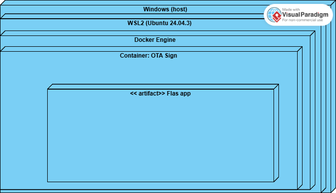
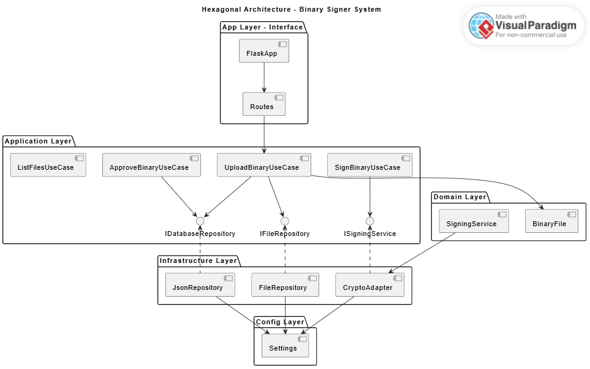

# Politécnica de Santa Rosa

| Subject         | Software Architectures                  |
|-----------------|-----------------------------------------|
| Title           | Final Project                           |
| Owner           | [Jesus Salvador Lopez Ortega](mailto:jlopez@upsrj.edu.mx) |


## Deployment URL Diagram



## Components UML diagram




## Proyect Structure

```bash
OTA Sign/
│
├── src/
│   ├── app/
│   │   ├── _init_.py
│   │   ├── main.py                  # Flask entrypoint (Web Adapter)
│   │   └── routes.py                # HTTP routes
│   │
│   ├── domain/
│   │   ├── _init_.py
│   │   ├── models.py                # Entidades: BinaryFile, Signature, Approval
│   │   └── services.py              # Lógica de dominio: firmar, aprobar, validar
│   │
│   ├── application/
│   │   ├── _init_.py
│   │   ├── use_cases.py             # Casos de uso: upload, sign, approve, list
│   │   └── ports.py                 # Interfaces hacia infra (repositorios, firmas)
│   │
│   ├── infrastructure/
│   │   ├── _init_.py
│   │   ├── file_repository.py       # Guarda y recupera archivos del folder /data
│   │   ├── json_repository.py       # Simula la BD con un archivo .json
│   │   └── crypto_adapter.py        # Implementa la firma digital con cryptography
│   │
│   └── config/
│       ├── _init_.py
│       └── settings.py              # Config de entorno (dev/prod, rutas, claves)
│
├── data/
│   ├── dev_keys/
│   ├── prod_keys/
│   ├── signed/
│   └── binaries/
│
├── database.json                    # “Base de datos” local
├── requirements.txt
└── README.md


